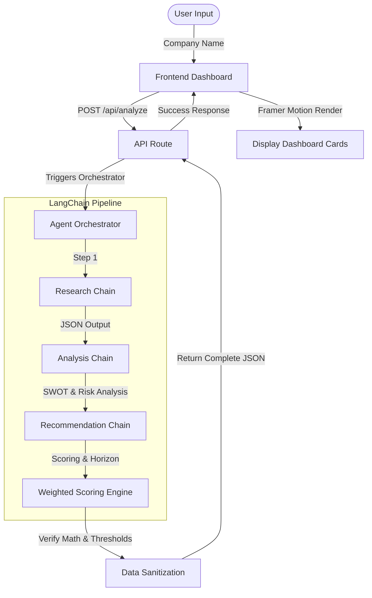

# AlphaLens AI - AI Investment Research Agent

AlphaLens AI is a modern, premium, and minimal AI-powered investment research agent. It conducts multi-step, sequential financial analysis on any user-specified company and evaluates whether investors should **Invest**, **Watchlist**, or **Pass**, supported by comprehensive qualitative reasoning and a weighted scoring engine.

---

## 📈 Project Overview
Traditional equity research takes hours of pulling filings, reading transcripts, and synthesizing data. **AlphaLens AI** uses sequential LangChain reasoning chains to compile a deep strategic and financial profile of a business, run a SWOT analysis, evaluate growth vectors, audit risks, and score the investment opportunity across five core dimensions using Google's Gemini API.

---

## ✨ Features
- **Sleek Glassmorphic Dashboard**: A premium dark-mode dashboard with custom glow states, circular confidence meters, and visual cards.
- **Dynamic Multi-Step Loading Experience**: An animated progress stepper simulating the multi-layer research workflow.
- **Three-Tier Sequential Chains**: Modular chain pipeline (`Research` ➡️ `Analysis` ➡️ `Recommendation`) structured in LangChain.js.
- **Strict Programmatic Scoring System**: Recalculates category weightings programmatically to enforce arithmetic accuracy (eliminating LLM math bugs).
- **Recent Search Terminal**: Local history tracking (`localStorage`) that caches and lists recent searches.
- **Responsive Layout**: Designed for mobile and desktop screens.

---

## 🏗️ Architecture Diagram
Below is the request lifecycle and execution pipeline:



---

## 📁 Folder Structure
The codebase follows a modular structure:
```text
Assigment online/
├── src/
│   ├── app/
│   │   ├── api/
│   │   │   └── analyze/
│   │   │       └── route.ts       # Backend Next.js API route
│   │   ├── globals.css            # Dark mode styles & custom utilities
│   │   ├── layout.tsx             # Root layout & page metadata
│   │   └── page.tsx               # Main Dashboard page (Client Controller)
│   ├── chains/
│   │   ├── index.ts               # Orchestrator & Scoring math validation
│   │   ├── researchChain.ts       # Step 1: Company data gatherer
│   │   ├── analysisChain.ts       # Step 2: SWOT and strategic auditor
│   │   └── recommendationChain.ts # Step 3: Scoring assigner
│   ├── components/
│   │   ├── SearchBar.tsx          # Search component with suggestion chips
│   │   ├── LoadingProgress.tsx    # Multi-step animated progress bar
│   │   ├── ScoreCard.tsx          # Five-factor weighted progress bars
│   │   ├── SWOTCard.tsx           # Glowing 2x2 grid representing SWOT
│   │   ├── ConfidenceMeter.tsx    # Animated SVG radial confidence meter
│   │   ├── RecommendationBadge.tsx# Action status badge (Invest, Watchlist, Pass)
│   │   └── Footer.tsx             # Professional dashboard footer
│   ├── prompts/
│   │   ├── research.txt           # Prompt template for Research Chain
│   │   ├── analysis.txt           # Prompt template for Analysis Chain
│   │   └── recommendation.txt     # Prompt template for Recommendation Chain
│   ├── types/
│   │   └── index.ts               # Complete TypeScript interfaces
│   └── lib/
│       └── utils.ts               # Utility wrapper for merging Tailwind classes
├── .env.example                   # Template env configurations
├── package.json                   # Project scripts and dependencies
└── tsconfig.json                  # TypeScript compiler settings
```

---

## ⚙️ Environment Variables
The application requires a Gemini API key. Create a `.env` file in the root directory (a template is pre-created for you):

```env
GOOGLE_API_KEY=your_gemini_api_key_here
```
> Get a free API key at [Google AI Studio](https://aistudio.google.com/).

---

## 🚀 How to Install & Run

### 1. Install Dependencies
In the root directory, install the required packages:
```bash
npm install
```

### 2. Start the Development Server
Run the local next server:
```bash
npm run dev
```
Open **[http://localhost:3000](http://localhost:3000)** in your browser to view the application.

### 3. Build for Production
To test production compiles:
```bash
npm run build
npm run start
```

---

## 🧠 How LangChain.js & Prompts Work
AlphaLens uses **LangChain Expression Language (LCEL)** structures to guide the Gemini model.

1. **Sequential Chaining**: Instead of asking the AI to analyze everything at once (which degrades detail), the task is broken into three steps:
   - **Research**: Gathers raw business facts and revenue allocations.
   - **Analysis**: Conducts SWOT and audits risks.
   - **Recommendation**: Compares research and SWOT inputs to score and label the asset.
2. **Strict Output Parsing**: Prompt instructions require Gemini to output JSON without markdown wrappers, which is then cleaned by our custom sanitizer (`cleanJsonResponse`) and parsed into static TypeScript structures.

---

## 📊 Scoring Logic
To guarantee mathematical precision, the final score is calculated **programmatically** in the orchestrator file using the specific weightings rather than relying on LLM math:

| Category | Weight | Description |
| :--- | :---: | :--- |
| **Business Quality** | `25%` | Product-market fit, scalability, management |
| **Growth Potential** | `20%` | TAM size, vectors of expansion |
| **Competitive Advantage** | `20%` | Structural moats, switching costs, brand value |
| **Risk Mitigation** | `15%` | Mitigating core headwinds (higher is safer) |
| **Market Opportunity** | `20%` | Sector tailwinds and macroeconomic support |

### Score Thresholds
- 🟢 **Score >= 80**: **Invest**
- 🟡 **Score 60 - 79**: **Watchlist**
- 🔴 **Score < 60**: **Pass**

---

## 🔮 Future Improvements
- **Live Yahoo Finance Integrations**: Fetching real-time market data, price-to-earnings, and beta.
- **SEC Filing Scrapers**: Integrating SEC Edgar API to pull official Form 10-K and 10-Q documents.
- **Export PDF Report**: Button to download the generated visual research report as a PDF.
- **Portfolio Tracking**: Save analyzed companies into a watchlist database.

---

## 🌐 Deployment
AlphaLens can be deployed with one click to **Vercel**:
1. Push your code to GitHub.
2. Link your repository to Vercel.
3. Add the `GOOGLE_API_KEY` to Vercel Environment Variables.
4. Deploy!
